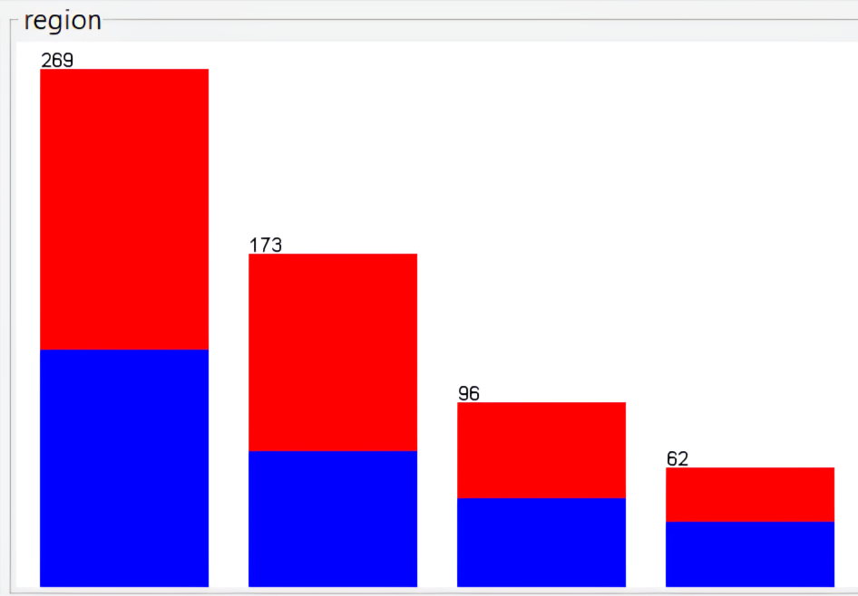

# Financial-Demographics-Weka-Analysis

A complete synthetic analysis pipeline built using Weka on a demographic-financial dataset. This project explores user behavior, financial product adoption, and demographic segmentation—all through attribute-specific visualizations auto-generated by Weka.

---

📂 Project Structure

```bash
Financial-Demographics-Weka-Analysis/
├── data/
│   └── financialdemographics100.arff       # Synthetic dataset with 100 entries
├── outputs/                                  # All Weka-generated visualizations
│   ├── 1000071750-Picsart-AirImageEnhancer.png  # Main combination of all plots
│   ├── IMG20250706202945.png                  # Age histogram
│   ├── IMG20250706203017.png                  # Sex pie chart
│   ├── IMG20250706203034.png                  # Region histogram
│   ├── IMG20250706203053.png                  # Income distribution
│   ├── IMG20250706203112.png                  # Marital status
│   ├── IMG20250706203129.png                  # Children count
│   ├── IMG20250706203143.png                  # Car ownership
│   ├── IMG20250706211047.png                  # Save account
│   ├── IMG20250706211110.png                  # Current account
│   ├── IMG20250706211129.png                  # Mortgage
│   ├── IMG20250706211204.png                  # PEP investment
│   ├── IMG20250706211449.png                  # Income again
│   └── IMG20250706211515.png                  # Age again
├── README.md                                  # This documentation file
└── LICENSE                                    # MIT License
```

---

# 📊 Summary of Analysis

This project was conducted using a synthetic dataset with 100 entries built for financial demographic profiling. Key attributes include:

- Demographics: Age, Sex, Region, Marital Status, Children  
- Financial indicators: Income, Car ownership, Saving account, Current account, Mortgage, PEP investment  

Using Weka’s built-in visualization capabilities, each attribute was analyzed and plotted to uncover relationships, data quality, and segmentation patterns.

# 📌 Some key insights:
- Age distribution leans toward middle-aged individuals with occasional spikes in senior profiles.
- Gender distribution shows a balanced sample with slight female dominance.
- Region data helps uncover urban vs rural financial behavior segmentation.
- Income histogram & boxplots indicate economic diversity with visible outliers.
- Financial product ownership varies significantly across demographics, visible via pie charts.

All outputs were saved inside the /outputs/ folder and sequenced exactly as they appear in the PDF, starting with the combined overview and followed by individual attribute plots.

---

# 📷 Visualizations

### 🧩 Main Combination of All Plots


---

### 🔢 Attribute-Specific Visuals (Sequential)

#### 1. Age Distribution


#### 2. Sex Distribution


#### 3. Region Frequency


#### 4. Income Distribution


#### 5. Marital Status


#### 6. Children Count


#### 7. Car Ownership


#### 8. Save Account


#### 9. Current Account


#### 10. Mortgage Status


#### 11. PEP Investment


#### 12. Income (Zoomed / Reanalyzed)


#### 13. Age (Reanalyzed)


---

# 🧪 Technologies Used

- Weka Explorer
- Synthetic ARFF dataset generation
- Visual attribute analysis (histograms, pie charts, boxplots)
- Manual sequencing and documentation

---

# 🧾 License

This project is released under the MIT License  
Created and maintained by @Gyanankur23

---

# 🙌 Author

### 👤 Gyanankur Baruah  
### 📧 gyanankurcricket20@gmail.com  
### 🧠 Data storyteller & explorer, blending creative analysis with structured documentation.

---

Need help generating .csv subsets or building a classification model on this dataset? Just drop the word—I’m ready to assist across Python, Weka, or GitHub integration.

`
